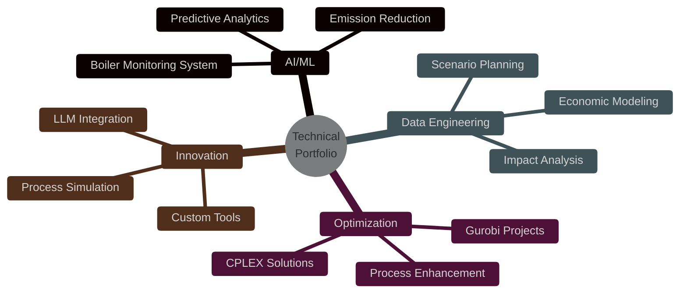

<div align="center">
  


[](https://www.linkedin.com/in/mohamed-ahmed-elbeskeri-phd-64a52b104/)
[](mailto:Mohamed.ahmed.4894@gmail.com)
[](https://github.com/m-ahmed-elbeskeri)


</div>

## 👨‍🔬 About Me 

```python
class DataDrivenEngineer:
    def __init__(self):
        # Personal Information
        self.name = "Mohamed Ahmed"           # 🧑‍💻
        self.role = "Analyst Consultant"      # 💼
        self.company = "Ricardo EE"          # 🏢
        self.education = "PhD Chemical Eng."  # 🎓
        self.location = "United Kingdom"      # 🌍
        
        # Technical Arsenal
        self.weapons_of_choice = {
            "languages": [
                "Python",      # 🐍 Master Language
                "C++",         # ⚡ Performance Critical
                "C#",          # 🎯 Enterprise Apps
                "VBA"          # 📊 Legacy Systems
            ],
            "ai_tools": [
                "scikit-learn",  # 🤖 ML Magic
                "TensorFlow",    # 🧠 Deep Learning
                "PyTorch"        # 🔥 Neural Networks
            ],
            "optimization": [
                "CPLEX",    # 📈 Mathematical Beast
                "Gurobi"    # 🎯 Linear Programming
            ],
            "data_craft": [
                "pandas",      # 🐼 Data Wrangling
                "numpy",       # 🔢 Number Crunching
                "matplotlib"   # 📊 Visual Stories
            ]
        }
    
    def get_superpowers(self):
        return [
            "AI & Predictive Sorcery",           # 🤖
            "Process Optimization Mastery",       # ⚙️
            "Sustainable Engineering",            # 🌱
            "Python Architecture & Development"   # 🛠️
        ]
```

<div align="center">

## 🎯 Technical Arsenal


</div>

## 💼 Featured Projects



## 🚀 Project Highlights

### 🏭 Industrial AI Solutions
- **Smart Boiler Monitor**: ML-powered system for real-time condition monitoring
- **Emission Oracle**: Predictive analytics for environmental compliance
- **Investment Analyzer**: ML models for billion-dollar scenario planning

### ⚡ Optimization Suite
- **Process Maximizer**: CPLEX/Gurobi integration for system optimization
- **Carbon Capture+**: Efficiency optimization for capture systems
- **Green Solutions**: Environmental impact reduction algorithms

<div align="center">

## 🛠️ Tech Stack


</div>

## 🎯 Current Missions

- 🤖 Advancing industrial AI applications
- 📊 Crafting next-gen decision support systems
- 🌍 Pioneering sustainable tech solutions
- 🔧 Building robust Python frameworks

---

<div align="center">


*"Engineering a sustainable future through AI and Python"*

</div>
