<div align="center">
  


<div style="display: flex; justify-content: center; gap: 10px;">

[](https://www.linkedin.com/in/mohamed-ahmed-elbeskeri-phd-64a52b104/)
[](mailto:Mohamed.ahmed.4894@gmail.com)
[](https://github.com/m-ahmed-elbeskeri)

</div>

<br>

<table>
<tr>
<td>

</td>
<td>

</td>
</tr>
</table>

</div>

## 🧬 Professional DNA

```python
class InnovativeEngineer:
    def __init__(self):
        self.identity = {
            "name": "Mohamed Ahmed",
            "title": "Analyst Consultant @ Ricardo EE",
            "expertise": "PhD Chemical Engineering",
            "location": "United Kingdom 🇬🇧"
        }
        
        self.core_strengths = {
            "innovation": {
                "AI & ML": ["🧠 Deep Learning", "🤖 Neural Networks", "📊 Predictive Analytics"],
                "Optimization": ["⚡ Process Enhancement", "🎯 Resource Optimization", "📈 Performance Tuning"]
            },
            "engineering": {
                "Process": ["🏭 System Design", "🔄 Simulation", "⚙️ Integration"],
                "Sustainability": ["🌱 Green Solutions", "♻️ Carbon Reduction", "🌍 Environmental Impact"]
            },
            "development": {
                "Languages": ["Python", "C++", "C#", "VBA"],
                "Frameworks": ["TensorFlow", "PyTorch", "scikit-learn"],
                "Tools": ["CPLEX", "Gurobi", "pandas", "numpy"]
            }
        }
        
    def mission(self):
        return "Driving industrial innovation through AI-powered solutions and sustainable engineering"
```

<div align="center">

## 🎯 Technical Arsenal

<table>
<tr>
<td align="center">

<br>

<br>

</td>
<td align="center">

<br>

<br>

</td>
<td align="center">

<br>

<br>

</td>
</tr>
</table>

</div>

## 🚀 Innovation Portfolio

```mermaid
%%{init: {
  'theme': 'dark',
  'themeVariables': {
    'primaryColor': '#2E3440',
    'primaryTextColor': '#88C0D0',
    'primaryBorderColor': '#4C566A',
    'lineColor': '#88C0D0',
    'secondaryColor': '#3B4252',
    'tertiaryColor': '#4C566A',
    'textColor': '#E5E9F0'
  }
}}%%
graph TB
    subgraph AI_Solutions["🤖 AI Solutions"]
        A1[Smart Boiler Monitor]
        A2[Emission Oracle]
        A3[Predictive Analytics]
    end
    
    subgraph Process_Optimization["⚡ Process Optimization"]
        B1[System Enhancement]
        B2[Resource Allocation]
        B3[Performance Tuning]
    end
    
    subgraph Sustainability["🌱 Sustainability"]
        C1[Carbon Capture+]
        C2[Green Solutions]
        C3[Impact Analysis]
    end
    
    subgraph Innovation["🔧 Innovation"]
        D1[Custom Tools]
        D2[Digital Twins]
        D3[ML Integration]
    end

    AI_Solutions --> Process_Optimization
    Process_Optimization --> Sustainability
    Sustainability --> Innovation
    Innovation --> AI_Solutions

    style AI_Solutions fill:#3B4252,stroke:#88C0D0,stroke-width:2px
    style Process_Optimization fill:#3B4252,stroke:#88C0D0,stroke-width:2px
    style Sustainability fill:#3B4252,stroke:#88C0D0,stroke-width:2px
    style Innovation fill:#3B4252,stroke:#88C0D0,stroke-width:2px
```



## 💼 Project Showcase

<table>
<tr>
<td width="50%" style="border: none;">

### 🤖 Industrial AI Excellence
<details>
<summary><b>Smart Boiler Monitor</b></summary>

- Advanced ML monitoring system
- Real-time performance optimization 
- Predictive maintenance capabilities
- Energy efficiency optimization
- Custom alert system integration
</details>

<details>
<summary><b>Emission Oracle</b></summary>

- Predictive emissions analytics
- Regulatory compliance monitoring
- Real-time data processing
- Environmental impact assessment
- Automated reporting system
</details>

<details>
<summary><b>Investment Analyzer</b></summary>

- ML-driven scenario planning
- Risk assessment algorithms
- ROI optimization models
- Custom visualization tools
- Automated report generation
</details>

</td>
<td width="50%" style="border: none;">

### ⚡ Optimization Mastery
<details>
<summary><b>Process Maximizer</b></summary>

- CPLEX/Gurobi optimization
- Resource allocation algorithms
- Performance benchmarking
- System integration
- Real-time monitoring
</details>

<details>
<summary><b>Carbon Capture+</b></summary>

- Efficiency optimization
- Performance tracking
- Sustainability metrics
- Cost reduction analysis
- Environmental impact assessment
</details>

<details>
<summary><b>Green Solutions</b></summary>

- Environmental impact reduction
- Sustainable process design
- Energy efficiency optimization
- Cost-benefit analysis
- Performance monitoring
</details>

</td>
</tr>
</table>

## 🛠️ Technology Stack

<div align="center">

### Core Technologies


### AI/ML Frameworks


### Data Science Tools


</div>

## 🎯 Current Initiatives

<table>
<tr>
<td width="25%" align="center">

### 🧠 AI/ML
- Neural Architecture
- Deep Learning
- AutoML Systems
</td>
<td width="25%" align="center">

### ⚙️ Systems
- Process Control
- Digital Twins
- Smart Analytics
</td>
<td width="25%" align="center">

### 🌍 Green Tech
- Carbon Reduction
- Energy Efficiency
- Sustainability
</td>
<td width="25%" align="center">

### 🔧 Innovation
- Custom Solutions
- ML Integration
- Tool Development
</td>
</tr>
</table>

---

<div align="center">


*"Empowering sustainable industrial transformation through AI innovation and engineering excellence"*

</div>
