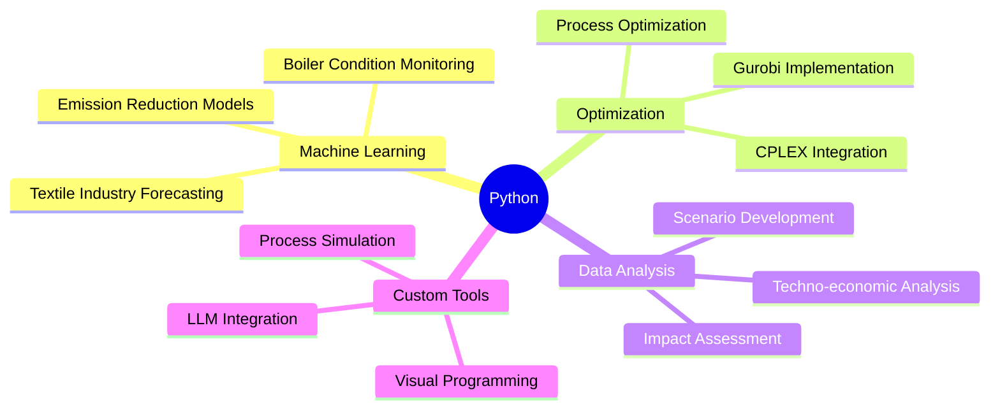

<div align="center">
  


[](https://www.linkedin.com/in/mohamed-ahmed-elbeskeri-phd-64a52b104/)
[](mailto:Mohamed.ahmed.4894@gmail.com)
[](https://github.com/m-ahmed-elbeskeri)

</div>

<div align="center">
  
> Data-Driven Chemical Engineer | Python Expert | Machine Learning Specialist 

</div>

## 👨‍🔬 About Me 

```python
class DataDrivenEngineer:
    def __init__(self):
        # Personal Information
        self.name = "Mohamed Ahmed"  # 👨‍💼
        self.role = "Analyst Consultant @ Ricardo EE"  # 💼
        self.education = "PhD Chemical Engineering"  # 🎓
        self.location = "United Kingdom"  # 🌍
        
        # Technical Skills Matrix
        self.skills = {
            "programming": [
                "Python",  # 🐍 Primary Language
                "C++",     # ⚡ Systems Programming
                "C#",      # 🎮 Application Development
                "VBA"      # 📊 Legacy Systems
            ],
            "ml_frameworks": [
                "scikit-learn",  # 🤖 Machine Learning
                "TensorFlow",    # 🧠 Deep Learning
                "PyTorch"        # 🔥 Neural Networks
            ],
            "optimization": [
                "CPLEX",   # 📈 Mathematical Optimization
                "Gurobi"   # 🎯 Linear Programming
            ],
            "data_analysis": [
                "pandas",     # 🐼 Data Manipulation
                "numpy",      # 🔢 Numerical Computing
                "matplotlib" # 📊 Data Visualization
            ]
        }
        
    def get_expertise(self):
        return [
            "Machine Learning & Predictive Modeling",     # 🤖
            "Optimization & Process Engineering",         # ⚙️
            "Sustainability & Carbon Capture",            # 🌱
            "Python Development & Tooling"               # 🛠️
        ]
```

## 🐍 Python Expertise

<div align="center">


</div>

### Key Python Projects & Implementations



## 💼 Featured Technical Projects

### 🏭 Industrial ML Applications
- Developed machine learning models for detecting overfire/underfire conditions in industrial boilers
- Implemented predictive analytics for emission reduction in textile industry
- Created forecasting models for multi-billion dollar investment scenarios

### ⚡ Optimization & Analysis
- Utilized CPLEX and Gurobi Python APIs for complex system optimization
- Maximized process profitability in carbon capture systems
- Developed environmental impact minimization algorithms

### 🛠️ Technical Tools & Frameworks

<div align="center">


</div>

## 🎯 Current Focus

- 🤖 Developing advanced ML models for industrial applications
- 📊 Creating data-driven decision support tools
- 🌍 Implementing sustainable technology solutions
- 🔧 Building Python tools for process optimization

---

<div align="center">


*"Leveraging Python and ML for sustainable industrial solutions"*

</div>
