<div align="center">
  


[](https://www.linkedin.com/in/mohamed-ahmed-elbeskeri-phd-64a52b104/)
[](mailto:Mohamed.ahmed.4894@gmail.com)
[](https://github.com/m-ahmed-elbeskeri)


</div>

## 👨‍🔬 About Me 

```python
class DataDrivenEngineer:
    def __init__(self):
        self.name = "Mohamed Ahmed"           # 🧑‍💻 Innovator
        self.role = "Analyst Consultant"      # 💼 Problem Solver
        self.company = "Ricardo EE"          # 🏢 Industry Leader
        self.education = "PhD Chemical Eng."  # 🎓 Expert
        self.location = "United Kingdom"      # 🌍 Global Perspective
        
        self.expertise = {
            "core_skills": {
                "AI & Machine Learning": ["🤖 Predictive Analytics", "🧠 Deep Learning"],
                "Process Engineering": ["⚡ Optimization", "🔄 Simulation"],
                "Sustainability": ["🌱 Green Solutions", "♻️ Carbon Reduction"],
                "Development": ["🐍 Python Architecture", "🛠️ Custom Tools"]
            },
            "tech_stack": {
                "languages": ["Python", "C++", "C#", "VBA"],
                "ml_frameworks": ["TensorFlow", "PyTorch", "scikit-learn"],
                "optimization": ["CPLEX", "Gurobi"],
                "data_science": ["pandas", "numpy", "matplotlib"]
            }
        }
```

<div align="center">

## 🎯 Core Competencies


</div>

## 💼 Featured Projects

```mermaid
%%{init: {'theme': 'dark', 'themeVariables': { 'primaryColor': '#2E3440', 'primaryTextColor': '#88C0D0', 'primaryBorderColor': '#4C566A', 'lineColor': '#88C0D0', 'textColor': '#E5E9F0', 'fontSize': '16px'}}}%%
graph LR
    A[🤖 AI Solutions] --> A1[Smart Boiler Monitor]
    A --> A2[Emission Oracle]
    A --> A3[Predictive Analytics]
    
    B[⚡ Optimization] --> B1[Process Maximizer]
    B --> B2[Carbon Capture+]
    B --> B3[Green Solutions]
    
    C[📊 Data Engineering] --> C1[Impact Analysis]
    C --> C2[Scenario Planning]
    C --> C3[Economic Modeling]
    
    D[🔧 Innovation] --> D1[Custom Tools]
    D --> D2[LLM Integration]
    D --> D3[Process Simulation]

    style A fill:#3B4252,stroke:#88C0D0,stroke-width:2px
    style B fill:#3B4252,stroke:#88C0D0,stroke-width:2px
    style C fill:#3B4252,stroke:#88C0D0,stroke-width:2px
    style D fill:#3B4252,stroke:#88C0D0,stroke-width:2px
```

<div align="center">



</div>

## 🚀 Project Highlights

<table>
<tr>
<td width="50%">

### 🏭 Industrial AI Solutions
- **Smart Boiler Monitor**
  - Real-time ML monitoring system
  - Predictive maintenance
  - Performance optimization
- **Emission Oracle**
  - Environmental compliance
  - Predictive analytics
  - Regulatory adherence
- **Investment Analyzer**
  - ML-driven scenario planning
  - Risk assessment
  - ROI optimization

</td>
<td width="50%">

### ⚡ Optimization Suite
- **Process Maximizer**
  - CPLEX/Gurobi integration
  - System optimization
  - Resource allocation
- **Carbon Capture+**
  - Efficiency optimization
  - Sustainability metrics
  - Performance tracking
- **Green Solutions**
  - Environmental impact
  - Cost reduction
  - Sustainability goals

</td>
</tr>
</table>

<div align="center">

## 🛠️ Technology Stack


</div>

## 🎯 Current Focus

<table>
<tr>
<td width="25%">

### 🤖 AI/ML
- Advanced analytics
- Neural networks
- Deep learning
</td>
<td width="25%">

### 📊 Systems
- Decision support
- Process control
- Automation
</td>
<td width="25%">

### 🌍 Sustainability
- Green tech
- Carbon reduction
- Efficiency
</td>
<td width="25%">

### 🔧 Development
- Python frameworks
- Custom tools
- Integration
</td>
</tr>
</table>

---

<div align="center">


*"Engineering a sustainable future through AI and innovative solutions"*

</div>
